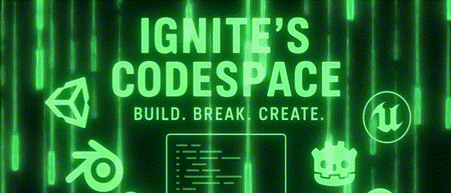

  

<h1 align="center" style="font-size: 50px; color: #32CD32; text-shadow: 0 0 10px #32CD32; font-family: 'Black Ops One', sans-serif;">
   Hi 👋, I'm Nepal Singh aka Ignite
</h1>

<h3 align="center" style="font-family: 'Black Ops One', sans-serif; background-color:#000000; padding: 15px; border-radius: 10px; color: #32CD32; text-shadow: 0 0 10px #32CD32;">
  A passionate full-stack web & game developer from India 🚀
</h3>

  
  
  

  

---

<h3 align="center" style="font-family: 'Black Ops One', sans-serif; background-color:#000000; padding: 10px; border-radius: 10px; color: #32CD32; text-shadow: 0 0 10px #32CD32;">
  🔗 Connect with me:
</h3>

  
  

---

<h3 align="center" style="font-family: 'Black Ops One', sans-serif; background-color:#000000; padding: 10px; border-radius: 10px; color: #32CD32; text-shadow: 0 0 10px #32CD32;">🚀 GitHub Stats & Contributions:</h3>

  
  

  

  

---

<h3 align="center" style="font-family: 'Black Ops One', sans-serif; background-color:#000000; padding: 10px; border-radius: 10px; color: #32CD32; text-shadow: 0 0 10px #32CD32;">💖 Support Me:</h3>

  
  

